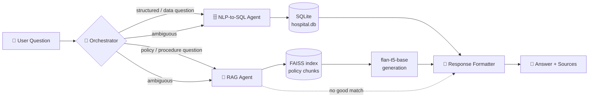

<div align="center">

# 🏥 Healthcare Query Assistant

**A multi-agent RAG + NLP-to-SQL system for hospital data and policy — with a real, deployable UI.**

[](https://www.python.org/)
[](https://streamlit.io/)
[](https://github.com/facebookresearch/faiss)
[](LICENSE)

[Features](#-features) • [Architecture](#-architecture) • [Getting Started](#-getting-started) • [Deployment](#-deployment) • [Project Structure](#-project-structure)

</div>

---

## 📖 Overview

**Healthcare Query Assistant** answers two very different kinds of hospital questions through two different, purpose-built agents — coordinated by an orchestrator that decides which one(s) should handle a given question:

| Ask about...                                                                | Handled by              | How                                                                                                                                                                                                   |
| --------------------------------------------------------------------------- | ----------------------- | ----------------------------------------------------------------------------------------------------------------------------------------------------------------------------------------------------- |
| **Patient data** — _"How many diabetic patients were admitted last month?"_ | 🗄️ **NLP-to-SQL Agent** | Parses the question into filters, builds real SQL, runs it against a live SQLite database.                                                                                                            |
| **Hospital policy** — _"Is prior insurance approval required for surgery?"_ | 📄 **RAG Agent**        | Retrieves the most relevant passages from the actual policy documents (FAISS + sentence embeddings) and grounds a generated answer in them — refusing rather than guessing when nothing matches well. |

No answer is ever pulled from a model's memorized "general knowledge" — patient numbers come from the real database, and policy answers are grounded in the real source documents, with sources and similarity scores shown for every claim.

> Built on top of `RAG_Healthcare_Query_Assistant.ipynb`. The orchestrator's routing rules, SQL templates, FAISS retrieval, and 0.25 similarity refusal threshold are carried over from the notebook's validated implementation — this project wraps that pipeline in a real, deployable Streamlit interface.

---

## ✨ Features

- **💬 Transparent chat interface** — every answer shows a live pipeline diagram of which agent(s) ran, plus an expandable trace of the generated SQL or the retrieved policy passages and their similarity scores.
- **📊 Interactive analytics dashboard** — filterable charts over the patient database: conditions, admission types, billing by insurer, age distribution, and admissions over time.
- **📄 Searchable policy library** — all five source policy documents with keyword search and highlighting.
- **🧠 Architecture explainer** — a plain-language walkthrough of the four-agent pipeline, built for demos.
- **📈 Routing & latency log** — every query asked in a session, with intent, confidence, and latency, downloadable as CSV.
- **⚡ Lightweight mode** — toggle off generative answers to skip loading the LLM entirely and get faster, fully-extractive (still grounded) policy answers.

---

## 🏗 Architecture



| Component              | Responsibility                                                                                                                                                                                                             |
| ---------------------- | -------------------------------------------------------------------------------------------------------------------------------------------------------------------------------------------------------------------------- |
| **Orchestrator**       | Classifies each query as `SQL`, `POLICY`, `AMBIGUOUS`, or `OUT_OF_DOMAIN` via transparent, auditable keyword/phrase scoring.                                                                                               |
| **NLP-to-SQL Agent**   | Extracts filters (condition, gender, blood type, admission type, insurer, age, dates), assembles a SQL query from templates, executes it.                                                                                  |
| **RAG Agent**          | Embeds the question, retrieves top-_k_ similar chunks from a FAISS index over the policy documents, and grounds a generated (or extractive) answer in them. Refuses below a similarity threshold instead of hallucinating. |
| **Response Formatter** | Normalizes whichever agent(s) ran into one consistent shape — a metric, a table, or sourced text — for the UI.                                                                                                             |

---

## 🛠 Tech Stack

| Layer           | Tools                                                                                                                                    |
| --------------- | ---------------------------------------------------------------------------------------------------------------------------------------- |
| UI              | [Streamlit](https://streamlit.io/), [Plotly](https://plotly.com/python/)                                                                 |
| Structured data | [SQLite](https://www.sqlite.org/), pandas                                                                                                |
| Retrieval       | [FAISS](https://github.com/facebookresearch/faiss) (`IndexFlatIP`), [sentence-transformers](https://www.sbert.net/) (`all-MiniLM-L6-v2`) |
| Generation      | [🤗 Transformers](https://huggingface.co/docs/transformers) (`google/flan-t5-base`)                                                      |

---

## 🚀 Getting Started

### Prerequisites

- Python 3.10+
- ~2 GB free disk space (for the downloaded embedding + generation models)

### Installation

```bash
git clone https://github.com/<your-username>/<your-repo>.git
cd <your-repo>

python -m venv venv
source venv/bin/activate        # Windows: venv\Scripts\activate

pip install -r requirements.txt
```

### Run

```bash
streamlit run app.py
```

The app opens at `http://localhost:8501`.

> **First launch is slower** — it downloads `all-MiniLM-L6-v2` and `google/flan-t5-base` from Hugging Face (a few hundred MB total, cached after that). To skip this entirely, turn off **"Use flan-t5 to compose policy answers"** in the sidebar — the RAG agent will then return the top matching policy passage directly instead of loading the generative model.

---

## 📁 Project Structure

```
healthcare_assistant/
├── app.py                     # Streamlit app — UI + agent orchestration
├── requirements.txt           # Python dependencies
├── README.md
└── data/
    ├── hospital.db             # normalized SQLite patient database
    ├── policy_index.faiss      # pre-built FAISS vector index over policy chunks
    ├── chunk_meta.pkl          # (doc_name, chunk_text) pairs matching the index
    ├── admission_policy.txt
    ├── billing_policy.txt
    ├── discharge_policy.txt
    ├── emergency_policy.txt
    └── insurance_policy.txt
```

---

## 🖥 Pages

| Page                     | What it shows                                                                                                                          |
| ------------------------ | -------------------------------------------------------------------------------------------------------------------------------------- |
| **💬 Chat Assistant**    | Ask a question; see the live routing pipeline, the answer, and its full evidence trail (generated SQL or retrieved passages + scores). |
| **📊 Dataset Analytics** | Filterable charts over the patient database.                                                                                           |
| **📄 Policy Library**    | Full text of the five policy documents with search.                                                                                    |
| **🧠 How It Works**      | Plain-language architecture walkthrough.                                                                                               |
| **📈 Routing Insights**  | Session log of every query's intent, confidence, and latency — exportable as CSV.                                                      |

---

## ☁️ Deployment

### Streamlit Community Cloud

1. Push this repo to GitHub (public or private).
2. Go to [share.streamlit.io](https://share.streamlit.io) → **New app**.
3. Select this repo/branch, set the main file path to `app.py`.
4. Deploy.

> The free tier has ~1 GB RAM. If the app is slow to boot or crashes on startup, turn off generative mode (see above) — `torch` + `flan-t5-base` are the heaviest pieces of the stack.

---

## ⚠️ Limitations & Notes

- The Orchestrator and NLP-to-SQL agent use rule/template-based logic rather than a trained model — fully auditable, but won't generalize to phrasing outside their known vocabulary.
- SQL filters are currently built with Python f-strings rather than parameterized queries. Safe under the current controlled vocabulary, but a production deployment should switch to bound parameters as defense-in-depth.
- No authentication is implemented — do not deploy with real patient data without adding access control first.
- The underlying dataset is a synthetic/sample dataset, not real patient records.

---

## 🗺 Roadmap

- [ ] Parameterized SQL queries
- [ ] Authentication / role-based access
- [ ] Swap keyword-based orchestrator for a lightweight trained classifier
- [ ] Optional hosted-LLM backend for higher-quality generated answers
- [ ] Automated retrieval/SQL accuracy evaluation suite

---

## 🤝 Contributing

Issues and pull requests are welcome. If you're proposing a significant change, please open an issue first to discuss what you'd like to change.

## 📄 License

This project is licensed under the [MIT License](LICENSE).

## 🙏 Acknowledgments

- [sentence-transformers](https://www.sbert.net/) for embeddings
- [FAISS](https://github.com/facebookresearch/faiss) by Meta AI for vector search
- [Google's FLAN-T5](https://huggingface.co/google/flan-t5-base) for generation
- [Streamlit](https://streamlit.io/) for the app framework


Live Demo :- https://healthcare-query-assistant-njgu7efjzj2kk82bqbcwko.streamlit.app/
